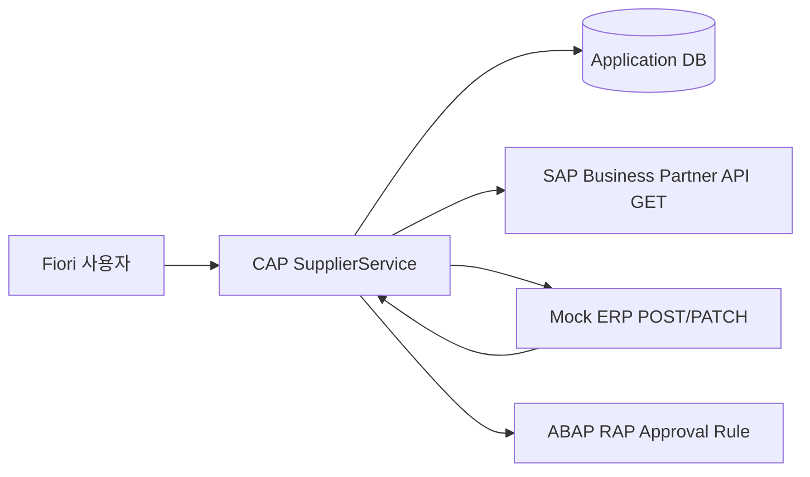

# SupplierFlow BTP + RAP

SAP BTP와 ABAP RAP를 학습하며 만든 개인 프로젝트입니다. 협력사 등록 요청부터 승인, SAP Business Partner 후보 조회, ERP 쓰기 시뮬레이션, 실패 재처리, ABAP RAP 승인 규칙 관리까지 하나의 업무 흐름으로 구성했습니다.

단순 CRUD 구현보다 SAP 기반 엔터프라이즈 시스템에서 중요한 **업무 프로세스 이해, 기준정보 연동, 상태 전이, 오류 복구, ABAP/BTP 확장 개발 구조**를 직접 다뤄보는 데 초점을 두었습니다. 관련 Solution Developer 직무에서도 SAP 업무 흐름을 기술 설계와 구현으로 연결한 경험으로 설명할 수 있습니다.

## 학습 및 구현 포인트

| 관련 역량 | 프로젝트에서 다룬 내용 |
| --- | --- |
| SAP ABAP/BTP 개발 | SAP BTP CAP 서비스, OData V4, Fiori elements, ABAP RAP 산출물 구성 |
| SAP ERP 업무 이해 | 협력사 기준정보 등록/승인, Business Partner 조회, ERP 반영 흐름 설계 |
| SAP 솔루션 기획 및 개발 | 요청자-승인자-관리자 역할, 상태 전이, 연동 로그, 재처리 프로세스 설계 |
| UI5/Fiori | Fiori elements List Report/Object Page 기반 화면 구조 |
| Database/SQL | SupplierRequest, DuplicateCandidate, IntegrationLog, IdempotencyLock 데이터 모델 |
| 운영 안정성 | 4xx/5xx 오류 분류, retry, idempotency key, correlation id, payload masking |

## 업무 시나리오

글로벌 제조 기업에서 신규 협력사를 등록할 때, 이메일이나 엑셀로 요청을 주고받으면 필수 정보 누락, 중복 등록, 승인 이력 분산, ERP 반영 결과 추적 문제가 생길 수 있습니다.

SupplierFlow는 이 흐름을 다음처럼 구조화합니다.

1. 요청자가 신규 협력사 정보를 입력합니다.
2. CAP 서비스가 필수값과 업무 상태 전이를 검증합니다.
3. SAP Business Partner 조회 Adapter가 중복 후보를 확인합니다.
4. 승인자가 요청을 승인하거나 반려합니다.
5. 승인 후 Mock ERP가 `MOCK-BP-xxxx` 형식의 협력사 번호를 반환합니다.
6. 실패 시 Integration Log에 HTTP 상태, 오류 코드, correlation id, retry 가능 여부를 기록합니다.
7. 관리자가 실패 건을 재시도하며 동일 idempotency key로 중복 생성을 방지합니다.

## Architecture



## 기술 구성

| 영역 | 사용 기술 |
| --- | --- |
| Main Backend | SAP CAP Node.js, OData V4 |
| Frontend | SAP Fiori elements, SAPUI5 manifest/annotations |
| Data | SQLite 로컬 DB, CAP CDS model |
| SAP 연동 | SAP Business Partner API 조회 Adapter |
| ERP 쓰기 | Node.js Mock ERP 서버 |
| ABAP 확장 | RAP CDS View Entity, Behavior Definition, Validation, Determination, Action, Service Definition |
| Test | Node.js test runner |

## CAP과 ABAP RAP 역할 분리

이 프로젝트는 CAP과 RAP를 같은 기능으로 중복 구현하지 않았습니다. 실제 SAP 확장 프로젝트에서 설명 가능한 구조를 만들기 위해 역할을 분리했습니다.

- **CAP**: 협력사 요청, 승인 상태, SAP BP 후보 조회, Mock ERP 쓰기, 연동 로그, 실패 재처리 담당
- **ABAP RAP**: 국가/협력사 유형/위험도 기준 승인 규칙 마스터 관리 담당

프로젝트 설명 시 강조할 수 있는 핵심 문장:

> CAP은 승인과 외부 연동을 오케스트레이션하고, ABAP RAP는 ERP 확장에 가까운 승인 규칙 마스터를 담당하도록 경계를 나눴습니다.

## 구현 범위와 정직한 경계

실제 S/4HANA 테넌트에 협력사를 생성했다고 주장하지 않습니다.

- 구현 완료: CAP OData 서비스, Fiori elements 설정, Mock ERP 쓰기, 실패/재시도 처리, 테스트 코드
- SAP 연동 가능 지점: SAP Business Accelerator Hub Business Partner GET Adapter
- ABAP RAP 산출물: ADT/BTP ABAP Environment에서 구현할 CDS, Behavior, Service, Class 예제
- 모의 처리: Business Partner POST/PATCH 쓰기와 오류 시나리오

무료 평가판 환경의 제약을 숨기지 않고, 실제 SAP 조회와 모의 ERP 쓰기를 명확히 분리했습니다.

## 주요 기능

- 협력사 요청 CRUD 및 상태 관리
- `DRAFT -> SUBMITTED -> APPROVED -> SYNCING -> SYNCED` 상태 전이
- 반려 후 재제출 흐름
- SAP Business Partner 중복 후보 조회 Adapter
- Mock ERP 생성/수정 API
- HTTP 4xx와 5xx/timeout 오류 분류
- 실패 연동 재시도 및 재시도 횟수 관리
- idempotency key 기반 중복 생성 방지
- IntegrationLog 기반 연동 추적
- 민감정보 payload masking
- ABAP RAP 승인 규칙 산출물
- 상태 전이, 오류 분류, Adapter, 멱등성 로직 테스트

## Project Structure

```text
db/                  CAP CDS 데이터 모델과 샘플 데이터
srv/                 CAP 서비스, 핸들러, SAP/ERP Adapter
app/                 Fiori elements manifest와 annotation
mock-erp/            로컬 ERP 쓰기 시뮬레이터
abap-rap/            ABAP RAP 구현 참고 산출물
docs/                아키텍처와 데모 스크립트
test/                비즈니스 규칙과 Adapter 테스트
```

## Local Run

```bash
npm install
copy .env.example .env
npm run mock-erp
```

다른 터미널에서 CAP 서비스를 실행합니다.

```bash
npm run watch
```

기본 URL:

- CAP OData: `http://localhost:4004/odata/v4/supplier`
- Mock ERP Health: `http://localhost:4010/health`

## Test

```bash
npm test
```

검증 항목:

- 협력사 요청 상태 전이
- 필수값 및 risk score 검증
- HTTP 4xx/5xx 오류 분류
- idempotency key 안정성
- SAP BP Adapter 응답 매핑
- Mock ERP Client 성공/실패 처리
- RAP 승인 등급 경계값 로직

## Demo Flow

1. `SupplierRequests`에서 신규 협력사 요청을 생성합니다.
2. `checkDuplicates` Action으로 SAP Business Partner 후보를 조회합니다.
3. 요청을 제출하고 승인합니다.
4. Mock ERP가 `MOCK-BP-xxxx` 번호를 반환하는 것을 확인합니다.
5. 500 오류 또는 timeout을 발생시켜 `SYNC_FAILED`와 IntegrationLog를 확인합니다.
6. `retrySync`로 같은 idempotency key를 사용해 재처리합니다.
7. ABAP RAP 승인 규칙 산출물에서 Validation, Determination, Action 흐름을 설명합니다.

## 이 프로젝트를 통해 다룬 역량

- SAP 업무 흐름을 데이터 모델과 API로 구체화하는 능력
- CAP, OData, Fiori 기반 BTP 애플리케이션 개발 이해
- ABAP RAP의 CDS, Behavior, Service Binding 흐름 이해
- ERP 연동에서 필요한 오류 처리와 재처리 설계
- 실제 구현 범위와 모의 구현 범위를 구분하는 정직한 개발 태도

## Summary

SAP BTP에서 CAP(Node.js)·Fiori 기반 협력사 등록/승인 시스템과 ABAP Cloud RAP 승인 규칙 앱 산출물을 설계했습니다. S/4HANA Business Partner API 조회 Adapter, Mock ERP 쓰기, 상태 전이, 멱등성, 실패 재처리, Integration Log, CDS/Behavior/OData V4/ABAP Unit 흐름을 다뤘습니다.
