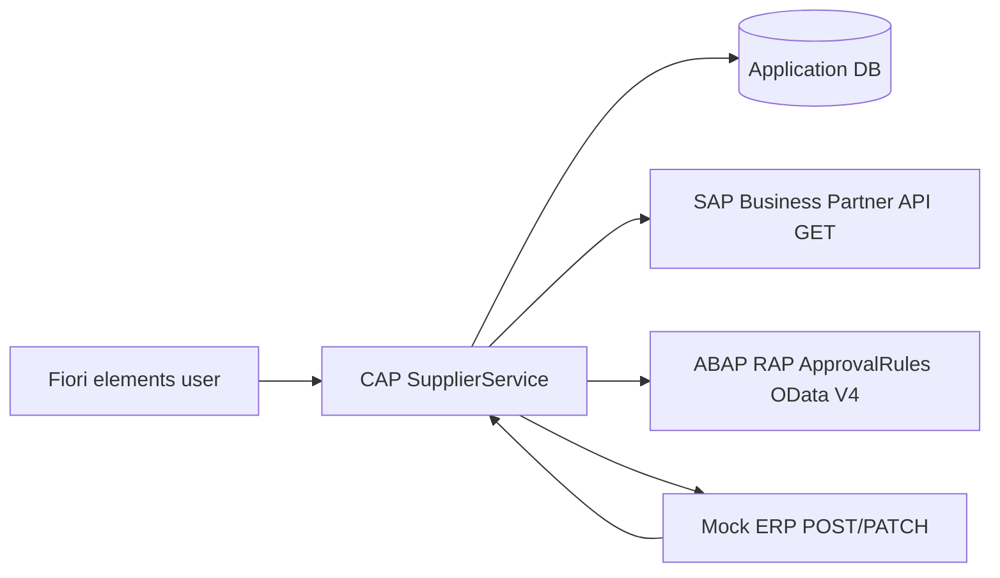

# Architecture

## Runtime Components

## CAP Responsibilities

- Supplier request CRUD.
- Submit, approve, reject, retry actions.
- SAP Business Partner duplicate candidate lookup.
- Mock ERP write using idempotency key.
- Integration logs and error classification.

## ABAP RAP Responsibilities

- Maintain approval rules by country and supplier type.
- Validate threshold ranges.
- Determine review level from risk threshold.
- Activate one active rule per country and supplier type.

## Error Policy

| Error | Meaning | Retry |
| --- | --- | --- |
| HTTP 4xx | Input or business error | No automatic retry |
| HTTP 5xx | Technical failure | Manual retry allowed |
| Timeout | Technical failure | Manual retry allowed |

## Truthful Portfolio Boundary

The project separates actual SAP read integration from simulated ERP write integration. That boundary is intentional and should be visible in README, demo video, and interview answers.
